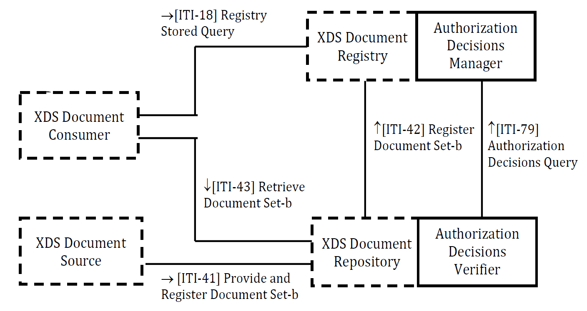
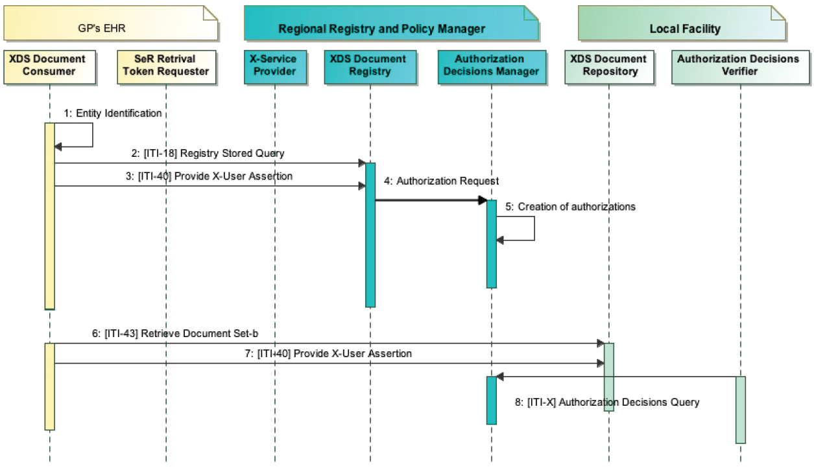
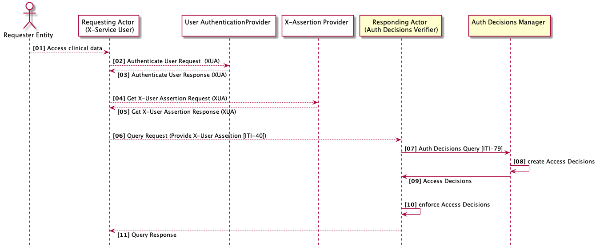
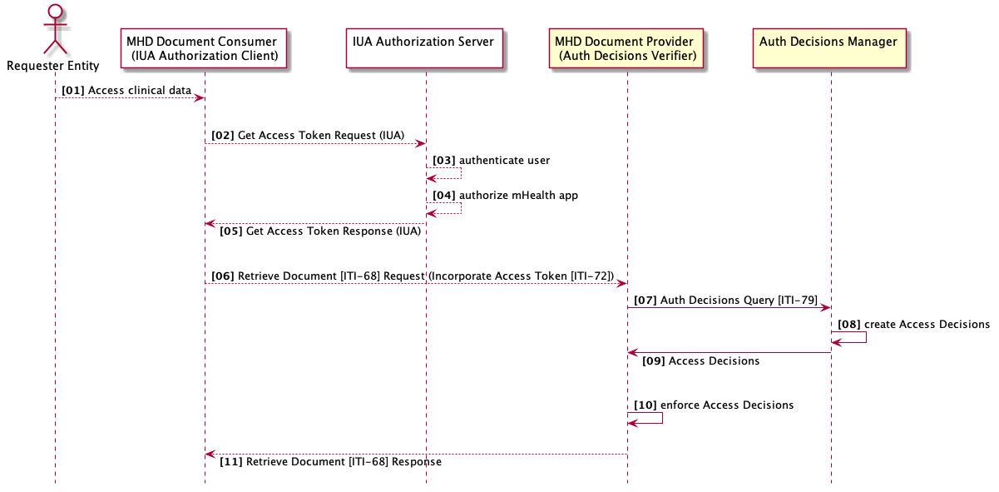
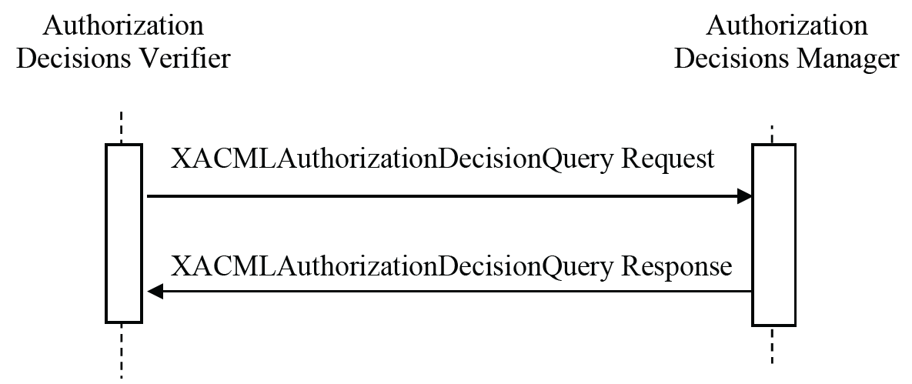

**Integrating the Healthcare Enterprise**


**[IHE ITI](https://profiles.ihe.net/ITI)**

**Technical Framework Supplement**

**Secure Retrieve (SeR)**

**Revision 1.6 - Trial Implementation**

Date: July 16, 2022

Author: ITI Technical Committee

Email: iti@ihe.net

**Please verify you have the most recent version of this document.** See [here](http://profiles.ihe.net/ITI) for Trial Implementation and Final Text versions and [here](https://profiles.ihe.net/ITI/#1.3) for Public Comment versions.

**Foreword**

This is a supplement to the IHE IT Infrastructure Technical Framework. Each supplement undergoes a process of public comment and trial implementation before being incorporated into the volumes of the Technical Frameworks.

This supplement is published on June 17, 2022 for trial implementation and may be available for testing at subsequent IHE Connectathons. The supplement may be amended based on the results of testing. Following successful testing it will be incorporated into the IT Infrastructure Technical Framework. Comments are invited and can be submitted using the [ITI Public Comment form](http://www.ihe.net/ITI_Public_Comments/) or by creating a [GitHub Issue](https://github.com/IHE/ITI.IUA/issues/new?assignees=&labels=&template=public-comment-issue-template.md&title=).

This supplement describes changes to the existing technical framework documents.

"Boxed" instructions like the sample below indicate to the Volume Editor how to integrate the relevant section(s) into the relevant Technical Framework volume.

| **Editor: Please amend Section X.X by the following** |
|------------------------------------------------------|

Where the amendment adds text, make the added text **<ins>bold underline</ins>**. Where the amendment removes text, make the removed text **~~bold strikethrough~~**. When entire new sections are added, introduce with editor's instructions to "add new text" or similar, which for readability are not bolded or underlined.

General information about IHE can be found at [http://www.ihe.net](http://www.ihe.net).

Information about the IHE IT Infrastructure domain can be found at [https://www.ihe.net/IHE_Domains](https://www.ihe.net/IHE_Domains/).

Information about the organization of IHE Technical Frameworks and Supplements and the process used to create them can be found at [https://www.ihe.net/about_ihe/ihe_process](https://www.ihe.net/about_ihe/ihe_process/) and [https://www.ihe.net/resources/profiles](https://www.ihe.net/resources/profiles/).

The current version of the IHE Technical Framework can be found at [https://profiles.ihe.net/](https://profiles.ihe.net/).

**CONTENTS**

<!-- TOC depthFrom:1 depthTo:2 -->

- [Introduction to this Supplement](#introduction-to-this-supplement)
- [Open Issues and Questions](#open-issues-and-questions)
- [Closed Issues](#closed-issues)
- [IHE Technical Frameworks General Introduction](#ihe-technical-frameworks-general-introduction)
	- [9 Copyright Licenses](#9-copyright-licenses)
- [IHE Technical Frameworks General Introduction Appendices](#ihe-technical-frameworks-general-introduction-appendices)
  - [Appendix A - Actor Summary Definition](#appendix-a---actor-summary-definitions)
  - [Appendix B - Transaction Summary Definitions](#appendix-b---transaction-summary-definitions)
  - [Appendix D - Glossary](#appendix-d---glossary)
- [Volume 1 - Profiles](#volume-1---profiles)
- [39 Secure Retrieve (SeR) Profile](#39-secure-retrieve-ser-profile)
  - [39.1 SeR Actors, Transactions, and Content Modules](#391-ser-actors-transactions-and-content-modules)
  - [39.2 SeR Actor Options](#392-ser-actor-options)
  - [39.3 SeR Required Actor Groupings](#393-ser-required-actor-groupings)
  - [39.4 SeR Overview](#394-ser-overview)
  - [39.5 SeR Security Considerations](#395-ser-security-considerations)
  - [39.6 SeR Cross Profile Considerations](#396-ser-cross-profile-considerations)
- [Volume 2 - Transactions](#volume-2--transactions)
		- [3.79 Authorization Decision Query \[ITI-79\]](#379-authorization-decisions-query-iti-79)
- [Volume 2 - Appendices](#volume-2--appendices)
- [Volume 3 - Content Modules](#volume-3--content-modules)
- [Volume 4 - National Extensions](#volume-4--national-extensions)


# Introduction to this Supplement

This supplement defines new functionalities for an affinity domain with a unique and
centralized Access Control system. This profile is limited to those deployment models
and their policies where a central authorization authority can make complete and
definitive decisions, yet support federated identity/authentication. In these
deployment models no actors except the central authorization authority
need to know the fine-grain policies to enforce.

The supplement describes how to create a "system of trust" between
the actor that can perform Access Decisions (on behalf of Consent Docs, Policies and
Creation/Access/Disclosure rules) and actors that actually store clinical data
and documents. For example, in a typical XDS environment, there are many XDS Document
Repositories that store documents. These systems are not aware of Consent Documents
published by patients, and cannot apply Access/Creation/Disclosure Policies to requests
for Document retrieval; then the replication of Access Control functionalities is
unfeasible and/or too expensive (due to integration burdens and total cost of ownership).

The objective of the Secure Retrieve Profile is the definition of a mechanism to convey
Authorization Decisions between affinity domain actors, attesting that the reliable
Authorization Decisions Manager implementing a Policy Decision Point (PDP) makes the
an access decision.

<!-- Dmytro: No changes are required below because this fragment describes _starting_
requirements and constraints, i.e. the history and not the current state. -->

The starting requirements/constraints upon which this profile is developed are described
below:

* A unique Authorization Decisions Manager (or PDP) performs access decision for all XDS Document
  Consumer and all XDS Document Repositories involved in the Affinity Domain.
* XDS Document Repositories cannot manage the whole set of information needed to perform
  access decisions (XDS Document Repositories are not required to store metadata.
  If the Repository stores metadata, the metadata might be insufficient to perform an
  access decision).
* The XDS infrastructure is not fully federated; a clear separation of duties and
  responsibilities between PDP and XDS Document Repositories is needed (Repositories
  store clinical documents; PDP evaluates access rights to those contents).
* The XDS Document Repositories must enforce access decision made by the Policy
  Decision Point.
* A technical pattern that reduces behavioral and transactional changes for the
  Consumer side is clearly preferred (lower costs for deployment and for security reasons).

This supplement is a standalone profile because it defines a flexible pattern that
could be used by any Service Provider that queries for Authorization Decisions
granted by a trusted Authorization Decisions Manager (or PDP). However,
the focus is to add Access Control functionalities to the XDS environment.

This profile introduces two new actors (Authorization Decisions Manager and
Authorization Decisions Verifier) and one new transaction (Authorization Decisions Query).

This profile does not describe how Authorization Decisions are performed. However,
this profile relies on the XACML-SAML framework for messages and transactions between
the actors.

This profile describes how a Service Provider (e.g. Document Repository) can request
Authorization Decisions for clinical data granted to an Requester Entity
(e.g., a user retrieving clinical documents).

# Open Issues and Questions

11. As the profile covers not only document retrieval, shall it be renamed from
    "Secure Retrieve" (SeR) to e.g. "User Authorization" (UAZ)?
12. A change in section 3.79.4.2.2 prescribes to populate the status code according
    to section 4.10 "Element <samlp:Response>: XACMLAuthzDecision Response" of OASIS
    SAML 2.0 profile of XACML v2.0 (errata) instead of using a fixed value
    `urn:oasis:names:tc:SAML:2.0:status:Success` -- this is because otherwise it would
    be impossible cover error cases. Does this change break the backward compatibility?
13. Shall information about human users in the Authorization Decisions Manager's audit
    record (added with the Swiss change proposal) be deleted again?
14. Shall the audit record definitions of the both actors be reworked to be made
    consistent with definitions in other IHE profiles?

# Closed Issues

1. Which is the best technical approach for the solution?
    - It is suggested an evaluation of both the technical approaches: SAML token vs. JWT
      Bearer token. A comparison between the two standards will be formalized in a document.
      First step: evaluation of the efficiency of the two solutions proposed.
    - A JWT token is only OAuth which is REST. What we may end up with is an equivalent
      of this in MHD. Right now, we are doing this for XDS, so the strategy should be:
        - Focus on SAML and SOAP, and advancing XUA.
        - Let MHD handle the RESTful equivalent after this is in TI.
    - Volume 1 should be independent of the standards selected. Volume 2 may eventually
      contain an extra piece that shows how OAuth, REST and MHD meet the same volume 1 need
      as the SAML/SOAP pieces that are developed this year.
    - Therefore, the plan is to proceed with SAML and SOAP for now, but not mention this
      in volume 1, only in volume 2.

2. I've introduced a transaction to "Request Retrieval Token". This allows in the same
   environment simple Consumer and Consumer compliant with SeR guideline. This is, from my
   point of view, acceptable because there are certain types of docs (administrative docs
   and so on...) that probably can be shared without Retrieval Token. In my perspective
   this choice brings flexibility to the solution. Is this reasonable?
    - This can be addressed silently defining Domain Policies that state that some documents
      can be retrieved without Retrieval Token. No reasons to profile this feature.

3. Many different patterns have been analyzed. An evaluation spreadsheet was produced.
   For further details see:
   [CRAC Standards Pattern Selection Criteria Matrix - 2020140323.xls](https://docs.google.com/spreadsheets/d/1h28WYMsr1AQI9wajBVJyPnKFIcVtqa98/edit#gid=1371981459)

4. Which is the best drafting approach for the supplement? (Suggestion to postpone this
   decision/discussion, after a deep analysis of the problem. This is something that can be
   addressed after the first face to face meeting, once we have clear the SCOPE and the
   USE CASES that can be covered)
    - The supplement is drafted as an independent supplement focused on an XDS environment.
      The pattern selected, allows to be applied for future applications to other use cases.
      Transaction [ITI-79] is profiled taking this in mind (extensible payload for the
      XACMLAuthorizationDecisionQuery Request message)

5. There was a proposal: Use Artifact Resolution Protocol (defined in SAML 2.0 core
   specification) instead of XACMLAuthzDecisionQuery. Rationale: The transaction [ITI-79]
   defines a standard semantic to check if an authorization token exists, but
   XACMLAuthzDecision Query is used to request and perform Authorization Decision.
    - The proposal was rejected: The use case does not require the sharing of SAML Artifact.
      The XACMLAuthzDecisionQuery does not require that the Authorization Decisions Manager
      performs access decisions following the XACML standard. XACML Authorization Query
      Request message just conveys needed parameters to locate an authorization. In addition
      to that, Artifact Resolution protocol seems to add some requirements that broke
      the basic use case "In all cases, the artifact MUST exhibit a single-use semantic
      such that once it has been successfully resolved, it can no longer be used by any
      party." And again: "The responder MUST enforce a one-time-use property on the artifact
      by ensuring that any subsequent request with the same artifact by any requester
      results in an empty response as described above." For the XDS use case, the
      Authorization Decisions Manager could request the same authorization many times;
      the one-shot authorization is not useful in this use case.

6. It was suggested to use Attribute Name:
   urn:oasis:names:tc:SAML:2.0:profiles:attribute:XPSA:subject
   in accordance to XSPA instead of the subject-id. The proposal was rejected. The using of
   the XSPA guideline does not add value, and add requirements that do not match with
   SeR use case..

7. This profile mandates the grouping between XDS Actors and XUA Actors (see Section 3).
   Readers are asked to provide feedback on this requirement. It is obvious that XUA
   environment (and SAML 2.0 token) is helpful for entity identification. Are there any
   other preferred approaches to perform this identification?
    - No other approaches are suggested. XUA grouping is confirmed.

8. Readers should focus on the XACML encoding defined for the XDSDocumentEntry.uniqueId
   and for the XUA Attribute Patient ID. Both this attribute are identified by the same
   @Category and same @AttributeId. This could create problems, because the Authorization
   Decisions Manager should interpret which is the docID and which is the patient ID. It is
   not clear to the tech committee how much the impact is.
    - A new urn is defined for patient ID.

9. This profile defines a mandatory grouping between Authorization Decisions Manager
   and Document Registry. It is an obvious grouping, but implementations could also use
   other approaches. Readers are asked to provide feedback on this requirement.
    - The profile does not profile the transaction to request Authorizations.
      This access decision is likely performed during the Query Request processing and
      requires input parameters local defined by the Domain. However, the performing of
      these decisions needs a lot of information managed by the Registry or conveyed
      within the Query Request. In accordance to this a grouping approach is proposed.

10. The pattern described in this profile requires the Pull of authorization from an
    Authorization Decisions Manager. This approach is compliant with XACML standard. For
    efficiency reasons a Push approach could be better. In a Push environment when an
    Authorization is granted for a resource, this authorization is sent to the XDS Document
    Repository that stores this resource. This approach is not described in standard
    specification yet.
    - The Pull approach is chosen to reduce computational load on the central
      Authorization Decisions Manager

# IHE Technical Frameworks General Introduction

The [IHE Technical Framework General Introduction](https://profiles.ihe.net/GeneralIntro/)
is shared by all of the IHE domain technical frameworks. Each technical framework volume
contains links to this document where appropriate.

## 9 Copyright Licenses

IHE technical documents refer to, and make use of, a number of standards developed and published by several standards development organizations. Please refer to the IHE Technical Frameworks General Introduction, Chapter 9 - [Copyright Licenses](https://profiles.ihe.net/GeneralIntro/ch-9.html) for copyright license information for frequently referenced base standards.

# IHE Technical Frameworks General Introduction Appendices

The [IHE Technical Framework General Introduction Appendices](https://profiles.ihe.net/GeneralIntro/index.html)
are components shared by all of the IHE domain technical frameworks. Each technical
framework volume contains links to these documents where appropriate.

<table border="1"><tr><td><i>
Update the following appendices to the General Introduction as indicated below.
Note that these are <b>not</b> appendices to this domain's Technical Framework
(TF-1, TF-2, TF-3 or TF-4) but rather, they are appendices to the IHE Technical
Frameworks General Introduction located
<a href="https://profiles.ihe.net/GeneralIntro/index.html">here</a>.
</i></td></tr></table>

## Appendix A - Actor Summary Definitions

<table border="1"><tr><td><i>
Add the following <b>new or modified</b> actors to the
<a href="https://profiles.ihe.net/GeneralIntro/ch-A.html">IHE Technical Frameworks
General Introduction Appendix A</a>
</i></td></tr></table>

| Actor | Definition |
|--|--|
| Authorization Decisions Manager  | Actor that can perform Access decision, evaluating requests for authorization. The result of this evaluation is an Access Decision that certifies the disclosing of clinical data.|
| Authorization Decisions Verifier | This actor queries for Authorization Decisions for Requester Entities used to enforce Access Decisions.|

## Appendix B - Transaction Summary Definitions

<table border="1"><tr><td><i>
Add the following <b>new or modified</b> transactions to the
<a href="https://profiles.ihe.net/GeneralIntro/ch-B.html">IHE Technical Frameworks
General Introduction Appendix B</a>
</i></td></tr></table>

| Transaction | Definition |
|--|--|
| Authorization Decisions Query [ITI-79] | Transaction used by the Service Provider (Authorization Decisions Verifier) to request Access Decisions to clinical data granted for the Requester Entity. |

## Appendix D - Glossary

<table border="1"><tr><td><i>
Add the following <b>new or modified</b> glossary terms to the
<a href="https://profiles.ihe.net/GeneralIntro/ch-D.html">IHE Technical Frameworks
General Introduction Appendix D</a>
</i></td></tr></table>

| Glossary Term | Definition |
|--|--|
| Access Decision Manager | A system that is responsible for access/creation/disclosure decisions performed according to Domain Policies, Consent Documents, etc. This actor may implement additional functionalities of Policy Decision Points (PDP), Policy Administration Points (PAP) and a Policy Information Points (PIP). |
| Authorization Decision  | An authorization token that describes whether clinical data can be accessed by a specific Requester Entity.|
| Requester Entity        | The entity identified within the identity assertion. This entity queries any actor grouped with the Authorization Decision Verifier for clinical data (e.g., documents). Access Decisions are created and associated with the Requester Entity.|

# Volume 1 - Profiles

<table border="1"><tr><td><i>
Add new Section 39
</i></td></tr></table>

## 39 Secure Retrieve (SeR) Profile

This profile defines a framework for a centralized Access Control system, which
separates the duties of creation and enforcement of Access Decisions.

The main objective of this profile is to create a system of trust between the actor
that produces Access Decisions (Authorization Decisions Manager), and actors that are groouped with Authorization Decisions Verifier to enforce the Access Decisions (e.g., XDS Document Repositories).

This type of approach is useful in many situations:

- XDS environments with many XDS Document Repositories which expose clinical documents
  without an access control system already implemented. These systems require minimal
  integration burden to support functionalities defined in this profile.
- Federation of repositories in a new Affinity Domain. The federation of repositories
  requires the subscription of the whole set of domain policies for content
  Creation/Access/Disclosure. A centralized Access Decision Manager coupled with the
  central XDS Document Registry allows the management of accesses to local Repositories
  without requiring the development of complex Access Control systems.
- Environments where Consent Documents, Policies and Data Access Rules can be collected,
  managed and discovered only in a centralized way.
- Sharing infrastructure with strong enforcement of Access Control systems. In many
  organizational and jurisdictional environments, access to clinical data is managed by
  Servers that store/register clinical data and cannot be regulated by the Consumer itself.

In those scenarios, this profile defines how to create a "logical federation" between an
Access Decision Manager (responsible for enabling/denying accesses) and
actors that enforce Access Decisions (e.g. XDS Document
Repositories that store documents and expose them without knowledge related to the
user/role/consent documents/policies etc.). Actors that store clinical data could only
trust a decision made by the Access Decision Manager.

Authorization Decision Manager functionalities are out of scope for this profile. The
implementation details typically are domain specific and locally defined.

This profile allows the creation of a system where the existence of a clinical data
item that cannot be accessed by a specific user is totally obscured from the
Requester Entity.

Creation, management and enforcement of policies are out of scope for this profile.

This profile allows addressing the following security risks (related to clinical data
exposure):

- The actor storing clinical data does not know the Access Decision that should be
  enforced. Therefore, if it denies access to data, there is a failure of availability.
  If it provides the document inappropriately, there is a risk to confidentiality.
  The SeR Profile allows this actor to be aware of the decision made, only asking for
  the existence of Authorizations granted by the trusted Access Decision Manager and
  enforcing that decision. In accordance with Affinity Domain policies, the
  actor storing clinical data can make further access control decisions.

- A separation of duties between the clinical data consumer (that requests authorization and
  clinical data items) and the Access Decisions Manager (or PDP) is created. The SeR Profile
  delegates decisions to the the Authorization Decisions Manager and the enforcement to the Authorization Decisions Verifier.

## 39.1 SeR Actors, Transactions, and Content Modules

This section defines the actors, transactions, and/or content modules in this profile.

Figure 39.1-1 shows the actors directly involved in the SeR Profile and the relevant
transactions between them.


_Figure 39.1-1: SeR Actor Diagram_

<!-- Dmytro: The original diagram is moved to section 39.4.2.1. -->

Table 39.1-1 lists the transactions for each actor directly involved in the SeR Profile.
To claim compliance with this profile, an actor shall support all required
transactions (labeled "R") and may support the optional transactions (labeled "O").

_Table 39.1-1: SeR Profile - Actors and Transactions_

| Actors                           | Transactions                             | Optionality | Reference      |
|----------------------------------|------------------------------------------|-------------|----------------|
| Authorization Decisions Manager  | Authorization Decisions Query [ITI-79] | R           | ITI TF-2: 3.79 |
| Authorization Decisions Verifier | Authorization Decisions Query [ITI-79] | R           | ITI TF-2: 3.79 |

The Authorization Decisions Query [ITI-79] provides support for different query types,
depending on which actor is grouped with the Authorization Decisions Verifier and which
transactions (which clinical data items) are in focus. This supplement profiles one standard
query type: "Retrieve Document Set Authorization Decision" and supports extensions for
other query types, which may be defined on vendor, community, regulatory domain, or
national level. The optionality of supporting various query types is a subject of
local regulations.

### 39.1.1  Actor Descriptions and Actor Profile Requirements

Most requirements are documented in Transactions (Volume 2) and Content Modules (Volume 3).
This section documents any additional requirements on profile's actors.

#### 39.1.1.1 Authorization Decisions Manager

The Authorization Decisions Manager is responsible for the management of access control
decisions in the entire affinity domain. From the Access Control point of view, this actor is
the unique Policy Decision Point (PDP) of the entire domain because it
may decide on the outcome of an incoming authorization request in order to provide access
to specific resources (e.g. documents). The Authorization Decisions Manager creates an
Access Decision.

<!-- Dmytro: See the sentence inserted below; token caching should not be a required feature. -->

The Authorization Decision does not need to be exposed to other systems, and it
certifies the decision made. The Authorization Decisions Manager may cache the
Access Decision and reuse it when processing subsequent requests with the same
parameters, if the local domain policies allow such behavior, and implement additional
Access Control functionalities required in the specific implementation scenario.

(Refer to the White Paper IHE ITI
[Access Control White Paper](https://www.ihe.net/Technical_Framework/upload/IHE_ITI_TF_WhitePaper_AccessControl_2009-09-28.pdf)
for further information about PDP and Access Control Systems.)

#### 39.1.1.2 Authorization Decisions Verifier

The Authorization Decisions Verifier is the actor that verifies if the Requester Entity
is authorized to access clinical data by querying the Authorization Decisions Verifier.
The Authorization Decisions Verifier actor acts as a Policy Enforcement Point (PEP)
and enforces the Access Decision made by the trusted Policy Decision Point.

(Refer to the White Paper IHE ITI
[Access Control White Paper](https://www.ihe.net/Technical_Framework/upload/IHE_ITI_TF_WhitePaper_AccessControl_2009-09-28.pdf)
for further information about PEP and Access Control Systems.)

## 39.2 SeR Actor Options

Options that may be selected for each actor in this profile, if any, are listed in the
Table 39.2-1. Dependencies between options when applicable are specified in notes.

_Table 39.2-1: SeR - Actors and Options_

| Actor                            | Option Name        | Reference |
|----------------------------------|--------------------|-----------|
| Authorization Decisions Manager  | No options defined | --        |
| Authorization Decisions Verifier | No options defined | --        |

## 39.3 SeR Required Actor Groupings

<!-- Dmytro: The paragraph is moved to section 39.4.2.1. -->

This profile requires the identification of the entity that queries clinical data.
Authorization Decisions are granted to a specific entity and can be used only by
that entity to get access to the clinical data.

Grouping with XUA Actors shall be supported. Other approaches for entity identification
may be defined by local domain policies.

An actor from this profile (Column 1) shall implement all of the required transactions
and/or content modules in this profile __*in addition*__ to all of the transactions required
for the grouped actor (Column 2).

Section 39.5 describes some optional groupings that may be of interest for security
considerations and Section 39.6 describes some optional groupings in other related profiles.

_Table 39.3-1: SeR - Required Actor Groupings_
<table border="1">
    <tr bgcolor="#eeeeee">
        <th>SeR Actor</th>
        <th>Actor to be grouped with</th>
        <th>Reference</th>
        <th>Content Bindings Reference</th>
    <tr>
    <tr>
        <td rowspan="2">Authorization Decisions Manager</td>
        <td>XUA X-Service Provider</td>
        <td><a href="https://profiles.ihe.net/ITI/TF/Volume1/ch-13.html#13.4">ITI TF-1: 13.4</a></td>
        <td>--</td>
    </tr>
    <tr>
        <td>ATNA Secure Node or Secure Application</td>
        <td><a href="https://profiles.ihe.net/ITI/TF/Volume1/ch-9.html#9.1">ITI TF-1: 9.1</a></td>
        <td>--</td>
    </tr>
    <tr>
        <td rowspan="2">Authorization Decisions Verifier</td>
        <td>XUA X-Service Provider</td>
        <td><a href="https://profiles.ihe.net/ITI/TF/Volume1/ch-13.html#13.4">ITI TF-1: 13.4</a></td>
        <td>--</td>
    </tr>
    <tr>
        <td>ATNA Secure Node or Secure Application</td>
        <td><a href="https://profiles.ihe.net/ITI/TF/Volume1/ch-9.html#9.1">ITI TF-1: 9.1</a></td>
        <td>--</td>
    </tr>
</table>

<!--
| SeR Actor                        | Actor to be grouped with               | Reference                                                                 | Content Bindings Reference |
|----------------------------------|----------------------------------------|---------------------------------------------------------------------------|----------------------------|
| Authorization Decisions Manager  | XDS Document Registry                  | [ITI TF-1: 10.1](https://profiles.ihe.net/ITI/TF/Volume1/ch-10.html#10.1) | --                         |
| --- " ---                        | XUA X-Service Provider                 | [ITI TF-1: 13.4](https://profiles.ihe.net/ITI/TF/Volume1/ch-13.html#13.4) | --                         |
| --- " ---                        | ATNA Secure Node or Secure Application | [ITI TF-1: 9.1](https://profiles.ihe.net/ITI/TF/Volume1/ch-9.html#9.1)    | --                         |
| Authorization Decisions Verifier | XDS Document Repository                | [ITI TF-1: 10.1](https://profiles.ihe.net/ITI/TF/Volume1/ch-10.html#10.1) | --                         |
| --- " ---                        | XUA X-Service Provider                 | [ITI TF-1: 13.4](https://profiles.ihe.net/ITI/TF/Volume1/ch-13.html#13.4) | --                         |
| --- " ---                        | ATNA Secure Node or Secure Application | [ITI TF-1: 9.1](https://profiles.ihe.net/ITI/TF/Volume1/ch-9.html#9.1)    | --                         |
-->

## 39.4 SeR Overview

### 39.4.1 Concepts

This section describes use-cases for the SeR Profile.

### 39.4.2 Use Cases

#### 39.4.2.1 Use Case #1: XDS Repositories with a centralized Access Decision Manager

This use case describes how an XDS Document Repository uses Authorization Decisions
made by the Authorization Decisions Manager.

<!-- Dmytro: The paragraph below is moved from section 39.3, the word "mandatory"
originally present there is removed. -->

In this use case the groupings between XDS Actors and SeR Actors enforce the system
of trust between the XDS Document Registry that localizes the XDS DocumentEntries
and the XDS Document Repositories that store XDS documents. This use case assumes
that Authorization Decisions are based on the document metadata and groups
the XDS Document Registry and the Authorization Decisions Manager for simplicity.

In this use case the XDS Document Repositories are all in the same XDS Affinity
Domain and delegate Access Decisions to the Authorization Decisions Manager grouped
with the XDS Document Registry.

In this use case the Authorization Decisions Manager manages all information
needed to perform an access decision and therefore combines the functionality of a
Policy Decision Point (PDP) and a Policy Information Point (PIP).

The Authorization Decisions Manager may also implement functions of a Policy
Administration Point (PAP), administering and maintaining Affinity Domain Policies.

In this use case a special implementation is used intended to increase the overall
perfomance. Access Decisions are created when the Requester Entity queries the XDS
metadata and stored for a specific time interval, expecting that the document metadatda
are queried from the XDS Registry before the documents are queried from the XDS
Repository within the time frame set by the Access Decision lifetime.     


_Figure 39.4.2.1-1: SeR Actor Diagram with XDS Actor Groupings_

<!-- Dmytro: This diagram is moved from section 39.1. -->

##### 39.4.2.1.1 XDS Repositories with a centralized Access Decision Manager Use Case Description

When an Requester Entity request documents from an XDS Repository, the XDS Document
Repository uses an Authorization Decisions Query [ITI-79] to query the Authorization
Decision from the Authorization Decisions Manager. The Authorization Decisions Manager
builds an Access Decision based on
- the information send with the Authorization Decisions Query [ITI-79]
- the document metadata stored in the XDS Registry
- the Patient Consent and the Access Policies.

The XDS Document Repository grouped with an Authorization Decisions Verifier enforces
the Access Decision returned with the Authorization Decisions Query [ITI-79].

For example:

Mr. White comes to his GP, Dr. Brown, to show him a Laboratory Report. This Laboratory
Report is shared in an XDS infrastructure. Using his EHR, Dr. Brown queries for Mr. White's
Laboratory Reports shared in the XDS infrastructure. The Query Response returns some
DocumentEntries to the XDS Document Consumer. Each XDSDocumentEntry in the response is
authorized for the retrieval. Dr. Brown uses his XDS Document Consumer to retrieve these
documents. The XDS Document Repository enforces the Access Decision for each document
requested by limiting the documents provided to Dr. Brown.

##### 39.4.2.1.2 XDS Repositories with a centralized Access Decision Manager Process Flow


_Figure 39.4.2.1.2-1: Process Flow of the use-case_


#### 39.4.2.2 Use Case #2: Query Type Extension Use Case

This use case describes how an XDS Affinity Domain uses the SeR Profile to
enforce authorization for all actors which manage sensitive data and uses
various query types in a national extensions.

In this use case sensitive information has been identified to be:
- clinical documents which contain the details of the disorder and the treatment
- the document metadata which contain information on the author and clinical facility
which may be used to draw conclusions about the disorder
- the patient identifiers which contain identifier of the assigning authorities and
may be used to draw conclusions about about the disorder
- the personal data of the healthcare professionals and their relation to institutions
which may be used to draw conclusions about the employer-employee relationship

To protect the sensitive information against malicious misuse the following actors
in the Affinity Domain are grouped with the Authorization Decisions Verifier:
- XDS Document Repository
- XDS Document Registry
- Patient Demographics Supplier
- Healthcare Provider Directory

These actors use Authorization Decisions Query [ITI-79] messages whenever a Requester
Entity queries for the sensitive data to retrieve an Access Decision from a single
Authorization Decisions Manager in the Affinity Domain and disclose the data only
in the case the access is authorized.

Actors which request sensitive information are grouped with the X-Service User actor
of the XUA Profile. They use the authentication data identifying the Requester
Entity to retrieve the X-User Assertion from the X-Assertion Provider and provides
the X-User Assertion in the security header of the request for sensitive information.
The X-User Assertion conveys the identity data and further information required
for Access Decisions (user role, user institution, etc.) from other sources
(e.g., Healthcare Provider Directory).

The information required by the Authorization Decisions Manager differs depending on
the actor which is queried for sensitive information. The difference is reflected in
the query options choosen and different query types are used, which are specified as
extensions (e.g., national extension) to this profile.

##### 39.4.2.2.1  Query Type Extension Use Case Description

A healthcare professional queries sensitive data which requires authorization from
an actor managing the data. The actors involved perform all nessesary actions to
enforce Access Decision for the data in the background and returns only the data
the healthcare professional is autorized for.    

The actor used by the healthcare professional to query the sensitive information
perfoms the following steps:  
- authenticate the healthcare professional
- exchange the authentication assertion to an X-User Assertion
- perform the query adding the X-User Assertion in the security header of the query request.

The actor queried for the sensitive data performs the following steps:
- request an Access Decision from the Authorization Decisions Manager using the information provided with the query payload and the X-User Assertion
- enforce the Access Decision returning only the data the healthcare professional is authorized for.  

##### 39.4.2.2.2  Query Type Extension Process Flow


_Figure 39.4.2.2.2-1: Process Flow of the use case with query type extension. Actors profiled in this supplement are yellow boxed and transactions profiled are drawn as solid lines._


#### 39.4.2.3 Use Case #3: Mobile Health Use Case

This use case describes how an MHD Document Responder uses Authorization Decisions
made by the Authorization Decisions Manager.

To protect the sensitive information against malicious misuse the MHD Document
Responder is grouped with the Authorization Decisions Verifier and performs
an Authorization Decisions Query [ITI-79] messages whenever a MHD Document
Consumer queries for the sensitive data to disclose the data based on the Access
Decision.

In this use case the MHD Document Consumer actor is grouped with IUA Authorization Client
actor and uses the data provided by the IUA Authorization Server which identifies
the Requester Entity and further information required for Access Decisions (user role,
user institution, etc.).

In addition the MHD Document Responder is grouped with the IUA Resource Server to
support the Incorporate Access Token [ITI-72] transaction.

##### 39.4.2.3.1  Mobile Health Use Case Description

In this use case Dr. Brown uses the new mHealth infrastructure provides by his
hospital.

Dr. Brown uses her tablet to query the laboratory reports of her patient Mr. White.
The hospitals mHealth app has previously been registered and authorized by
the hospital IT authorizing the mHealth app to perform the transactions defined in
the MHD Profile.

The mHealth infrastructure enforces access decisions in the background and discloses
the laboratory reports depending on the access policies of the hospital (e.g.,
identity and role of Dr. Brown, employment state, etc.).

##### 39.4.2.3.2  Mobile Health Use Case Process Flow


_Figure 39.4.2.3.2-1: Process Flow of the mhealth use case. Actors profiled in this supplement are yellow boxed and transactions profiled are drawn as solid lines._


## 39.5 SeR Security Considerations

To prevent interaction with malicious third parties, a closed system of trust based on
TLS digital identities is strongly recommended. Authorization Decisions Manager should
accept queries only from a restricted set of Secure Nodes/Applications. The Authorization
Decisions Verifier should perform queries only to the domain-identified Authorization
Decisions Manager.

Access Decisions my be collected by the Authorization Decisions Manager. These
Access Decisions should not be exposed to other systems and encryption may be used
(when stored by the Authorization Decisions Manager) to avoid the disclosure
of sensitive information.

The centralized Access Control system introduces a single point-of-failure risk in the
affinity domain. A failure of the Authorization Decisions Manager could result in
legitimate access being denied.

This profile introduces an XDS Error Code in order to codify an additional reason for
document retrieve failure. See [ITI TF-3: Table 4.2.4.1-2](https://profiles.ihe.net/ITI/TF/Volume3/ch-4.2.html#4.2.4.1).

Adding more technical details within the failure response may be used to refine
malicious requests. For example, if the error created by the Authorization Decisions
Verifier conveys the reason of the failure, such as "the authorization is expired" or "the
authorization is released in a different Functional Context," it may provide
information to a malicious Document Consumer that can then try to refine subsequent requests.
This profile supports to hide the Access Decisions to the Requester Entity. In this
case, the aforementioned error code shall not be used.

## 39.6 SeR Cross Profile Considerations

XDS Document Consumer that participates in an XDS environment using SeR framework
shall be grouped with an [XUA X-Service User](https://profiles.ihe.net/ITI/TF/Volume1/ch-13.html).

XUA X-Service User involved in a SeR framework shall be able to identify the specific
Requester Entity conveying its logical identity (user ID, application ID, etc.)
within the `<Subject>/<NameID>` element.

# Volume 2 &mdash; Transactions

<table border="1"><tr><td><i>
Add Section 3.79
</i></td></tr></table>

## 3.79 Authorization Decisions Query [ITI-79]

### 3.79.1 Scope

This transaction is used by the Authorization Decisions Verifier to query for authorization
decisions, granted and managed by the Authorization Decisions Manager. These authorization
decisions are created for an Requester Entity that is authorized to disclose specific documents.

The information required to perfom Access Decision shall be conveyed with the
Authorization Decisions Query [ITI-79] request, i.e., the identifier of the
Requester Entity and other attributes required for a given use case.

This transaction is based on SOAP v1.2 exchange protocol and Synchronous Web services (see
[ITI TF-2: Appendix V](https://profiles.ihe.net/ITI/TF/Volume2/ch-V.html)).

### 3.79.2 Actor Roles

| Actor | Role |
|--|--|
| Authorization Decisions Manager  | This actor stores and manages Access Decisions granted for an Requester Entity and for specific clinical data.|
| Authorization Decisions Verifier | This actor queries for Access Decisions based on the Requester Entity and requested clinical data. |

### 3.79.3 Referenced Standards

- OASIS SOAP v1.2
- OASIS Security Assertion Markup Language (SAML) v2.0
- OASIS eXtensible Access Control Markup Language (XACML) v2.0
- OASIS Multiple resource profile of XACML v2.0
- OASIS SAML 2.0 profile for XACML v2.0
- OASIS Cross-Enterprise Security and Privacy Authorization (XSPA) Profile of SAML v2.0
  for Healthcare Version 2.0 (not normative)

### 3.79.4 Messages


_Figure 3.79.4-1: Interaction Diagram_

#### 3.79.4.1 XACMLAuthorizationDecisionQuery Request

This message shall be used by the Authorization Decisions Verifier to query the Authorization
Decisions Manager for Access Decisions. This message relies on the SAML v2.0 extension
for XACML and uses the element `<XACMLAuthzDecisionQuery>` to convey the subject
identifier and other query parameters. The request message complies
with the multiple resource profile of XACML v2.0 and the Authorization Decisions Verifier may query
Access Decisions for many clinical data items in one query. Actors involved support XUA and use
SAML assertions to identify entities (see [ITI TF-1: 39.5](#395-ser-security-considerations) and [ITI TF-1: 39.6](#396-ser-cross-profile-considerations)).
SAML attribute elements shall be mapped into xacml-context attribute elements as defined
in SAML 2.0 Profile of XACML v2.0 (Section 2).

##### 3.79.4.1.1 Trigger Events

Actors grouped with a Authorization Decisions Verifier triggers the XACMLAuthorizationDecisionQuery
Request when a Requester Entity requests clinical data items (e.g. a Retrieve Document Set Request
message) which require authorization.

##### 3.79.4.1.2 Message Semantics

The XACMLAuthorizationDecisionQuery Request message shall use SOAP v1.2 message encoding.

The WS-Addressing Action header shall have this value:

- `urn:ihe:iti:2014:ser:XACMLAuthorizationDecisionQueryRequest`

The body of the message shall use an `<XACMLAuthzDecisionQuery>` element (defined in the
SAML 2.0 Profile for XACML v2.0) to convey Authorization Query parameters.

This element shall contain the following attribute:

- `@ReturnContext`: shall be set to "false" because the content of the
  XACMLAuthorizationDecision Request is not needed within the Authorization Result.

IHE does not define constraints for other attributes (see OASIS SAML 2.0 Profile of
XACML Version 2.0 Section 4 for details).

The `<XACMLAuthzDecisionQuery>` element shall have only one child element `<Request>`.
This element shall comply with OASIS Multiple resource profile of XACML v2.0.
This element shall have the following child elements:

- Exactly one child element `<Subject>` that identifies the Requester Entity.
- One or more elements `<Resource>` that identify particular clinical data items or classes
  of clinical data items.
- Exactly one element `<Action>` that identifies the action the Authorization
  Decisions Manager has to authorize.
- Exactly one element `<Environment>` that identifies run-time properties of the
  execution context.

Particular assignment of attributes on these elements depends on the query type,
as described in the next sub-section.

###### 3.79.4.1.2.1 Query Types and Request Attribute Assignments

Currently, there is only one standard query type: "Retrieve Document Set
Authorization Decision". Additional query types may be defined on vendor,
community, regulatory domain, or national level.

###### 3.79.4.1.2.1.1 Retrieve Document Set Authorization Decision Request Attributes

The SeR query type "Retrieve Document Set Authorization Decision" requires the
following assignment of request attributes:

- The `<Subject>` element shall have at least one child element `<Attribute>`
  characterized by `@AttributeId="urn:oasis:names:tc:xacml:1.0:subject:subject-id"`
  and `@DataType="http://www.w3.org/2001/XMLSchema#string"`. The `<AttributeValue>`
  child element shall convey the subject identifier. This element shall have the same
  value of the `<Subject>/<NameID>` element conveyed within the SAML assertion. See the
  [Provide X-User Assertion](https://profiles.ihe.net/ITI/TF/Volume2/ITI-40.html) [ITI-40]
  transaction for details. Any other SAML attribute related to the subject shall be added
  as additional XACML attribute. Table 3.79.4.1.2-1 defines which XUA attributes are
  identified as related to the subject (each attribute with "XACML Category" equal to
  `urn:oasis:names:tc:xacml:1.0:subject-category:access-subject`).

- There is one
  `<Resource>` element for each document requested by the Requester Entity. In the XDS
  environment, a `<Resource>` element identifies a document. Each document is identified
  by two required `<Attribute>` child elements.
    - The first `<Attribute>` element shall have
      `@AttributeId="urn:oasis:names:tc:xacml:1.0:resource:resource-id"` and
      `@DataType="http://www.w3.org/2001/XMLSchema#string"`. The `<AttributeValue>` child
      element stores the value of the XDSDocumentEntry.uniqueId.
    - The second `<Attribute>` element shall have
      `@AttributeId="urn:ihe:iti:ser:2016:document-entry:repository-unique-id"` and
      `@DataType="http://www.w3.org/2001/XMLSchema#anyURI"`. The `<AttributeValue>` child
      element stores the value of the XDSDocumentEntry.repositoryUniqueId.

Any other SAML attribute related to the resource requested shall be added as additional
XACML attribute (e.g., homeCommunityId). Table 3.79.4.1.2-1 defines which XUA attributes
are identified as related to the resource (each attribute with "XACML Category" equal
to `urn:oasis:names:tc:xacml:1.0:resource`).

Attributes that belong to the XACML environment category (e.g., XUA attributes with
"XACML Category" equal to `urn:oasis:names:tc:xacml:1.0:environment` in Table 3.79.4.1.2-1)
shall be added to an `<Environment>` element.

The `<Action>` element shall have a child element `<Attribute>` with
`@AttributeId="urn:oasis:names:tc:xacml:1.0:action:action-id"` and
`@DataType="http://www.w3.org/2001/XMLSchema#anyURI"`. This attribute shall have a child
element `<AttributeValue>` characterized by value:
`urn:ihe:iti:2007:RetrieveDocumentSetResponse`.

Additional attributes that belong to the XACML action category (e.g., XUA attributes with
"XACML Category" equal to `urn:oasis:names:tc:xacml:1.0:action` in Table 3.79.4.1.2-1)
shall be added to an `<Action>` element.

The mapping of attributes from SAML v2.0 assertion defined in the
[Provide X-User Assertion](https://profiles.ihe.net/ITI/TF/Volume2/ITI-40.html) [ITI-40]
transaction into XACML query attributes is defined below. For each attribute from [ITI-40],
the XACML Category and @AttributeId are identified:

_Table 3.79.4.1.2-1: [ITI-40] Attributes mapping into XACML Query Attributes_

| [ITI-40] Attribute                 | XACML Category                                               | AttributeId                                         | DataType                                |
|------------------------------------|--------------------------------------------------------------|-----------------------------------------------------|-----------------------------------------|
| Subject ID                         | urn:oasis:names:tc:xacml:1.0:subject-category:access-subject | urn:oasis:names:tc:xacml:1.0:subject:subject-id     | http://www.w3.org/2001/XMLSchema#string |
| Subject Organization               | urn:oasis:names:tc:xacml:1.0:subject-category:access-subject | urn:oasis:names:tc:xspa:1.0:subject:organization    | http://www.w3.org/2001/XMLSchema#string |
| Subject Organization ID            | urn:oasis:names:tc:xacml:1.0:subject-category:access-subject | urn:oasis:names:tc:xspa:1.0:subject:organization-id | http://www.w3.org/2001/XMLSchema#anyURI |
| Home Community ID (Note 1)         | urn:oasis:names:tc:xacml:1.0:subject-category:access-subject | urn:ihe:iti:xca:2010:homeCommunityId                | http://www.w3.org/2001/XMLSchema#anyURI |
| National Provider Identifier (NPI) | urn:oasis:names:tc:xacml:1.0:subject-category:access-subject | urn:oasis:names:tc:xspa:1.0:subject:npi             | http://www.w3.org/2001/XMLSchema#string |
| Subject Role                       | urn:oasis:names:tc:xacml:1.0:subject-category:access-subject | urn:oasis:names:tc:xacml:2.0:subject:role           | http://www.w3.org/2001/XMLSchema#anyURI |
| Authz-Consent                      | urn:oasis:names:tc:xacml:1.0:subject-category:access-subject | urn:ihe:iti:bppc:2007:docid                         | http://www.w3.org/2001/XMLSchema#anyURI |
| Patient Identifier                 | urn:oasis:names:tc:xacml:1.0:resource                        | urn:ihe:iti:ser:2016:patient-id                     | http://www.w3.org/2001/XMLSchema#string |
| PurposeOfUse                       | urn:oasis:names:tc:xacml:1.0:subject-category:access-subject | urn:oasis:names:tc:xspa:1.0:subject:purposeofuse    | http://www.w3.org/2001/XMLSchema#anyURI |

_Note 1: To enable authorization decisions for this [ITI-79] transaction, Home Community Id
identifies the requesting user's community identity as identified in the SAML header
in [ITI-40]. I.e., it is not the homeCommunityId of the community where the requested document
resides._

Any SAML 2.0 Attribute codified using the HL7 CD or CE dataType shall be codified into a
XACML Attribute using the percentage urn encoding and DataType
http://www.w3.org/2001/XMLSchema#anyURI as defined below:

`"urn:ihe:iti:2014:ser:[codeSystem]:[codeSystemName]:[code]:[displayName]"`

For example:

```xml

<saml:Attribute NameFormat="urn:oasis:names:tc:SAML:2.0:attrname-format:uri"
                Name=" urn:oasis:names:tc:xacml:2.0:action:purpose">
    <saml:AttributeValue>
        <value xmlns="urn:hl7-org:v3" xsi:type="CD"
               code="RECORDMGT"
               displayName="records management"
               codeSystem="2.16.840.1.113883.1.11.20448"
               codeSystemName="Purpose of Use"/>
    </saml:AttributeValue>
</saml:Attribute>
```

shall be codified in a urn:

```xml

<Attribute AttributeId="urn:oasis:names:tc:xspa:1.0:subject:purposeofuse"
           DataType="http://www.w3.org/2001/XMLSchema#anyURI">
    <AttributeValue>
        urn:ihe:iti:2014:ser:2.16.840.1.113883.1.11.20448:Purpose%20Of%20Use:RECORDMGT:records%20management
    </AttributeValue>
</Attribute>
```

Additional SAML 2.0 `<Attribute>` elements useful as authorization query parameters may
be identified by domain policies. Any additional `<Attribute>` can be provided to the
Authorization Decisions Verifier using a SAML v2.0 assertion. OASIS SAML 2.0 Profile of
XACML Version 2.0, Section 2 provides guidance in mapping SAML attributes into XACML
attributes. Domain Policies should define to which XACML category (Subject, Resource,
Action or Environment) each additional Attribute belongs.

###### 3.79.4.1.2.1.1.1 Example of a SOAP v1.2 XACMLAuthorizationDecisionQuery Request message

```xml
<?xml version="1.0" encoding="UTF-8"?>
<soap:Envelope xsi:schemaLocation="http://www.w3.org/2003/05/soap-envelope soap-envelope.xsd"
               xmlns:soap="http://www.w3.org/2003/05/soap-envelope"
               xmlns:xsi="http://www.w3.org/2001/XMLSchema-instance"
               xmlns:xacml-saml="urn:oasis:xacml:2.0:saml:assertion:schema:os">
    <soap:Header xsi:schemaLocation="http://www.w3.org/2005/08/addressing ws-addr.xsd"
                 xmlns:wsa="http://www.w3.org/2005/08/addressing">
        <wsa:Action>urn:ihe:iti:2014:ser:XACMLAuthorizationDecisionQueryRequest</wsa:Action>
        <wsa:MessageID>urn:uuid:9376254e-da05-41f5-9af3-ac56d63d8ebd</wsa:MessageID>
        <wsa:To>https://AuthorizationDecisionsManager</wsa:To>
    </soap:Header>
    <soap:Body
            xsi:schemaLocation="urn:oasis:xacml:2.0:saml:assertion:schema:os access_control-xacml-2.0-saml-assertion-schema-os.xsd">
        <xacml-samlp:XACMLAuthzDecisionQuery xmlns:xacml-samlp="urn:oasis:xacml:2.0:saml:protocol:schema:os"
                                             xacml-samlp:InputContextOnly="false" xacml-samlp:ReturnContext="false">
            <Request xmlns="urn:oasis:names:tc:xacml:2.0:context:schema:os"> <!-- Requester Entity identifier -->
                <Subject>
                    <Attribute AttributeId="urn:oasis:names:tc:xacml:1.0:subject:subject-id"
                               DataType="http://www.w3.org/2001/XMLSchema#string">
                        <AttributeValue>admin</AttributeValue>
                    </Attribute>
                </Subject> <!-- DOC 1 -->
                <Resource>
                    <Attribute AttributeId="urn:oasis:names:tc:xacml:1.0:resource:resource-id"
                               DataType="http://www.w3.org/2001/XMLSchema#string">
                        <AttributeValue>documentID1</AttributeValue>
                    </Attribute>
                    <Attribute AttributeId="urn:ihe:iti:ser:2016:document-entry:repository-unique-id"
                               DataType="http://www.w3.org/2001/XMLSchema#anyURI">
                        <AttributeValue>urn:oid:1.2.3.4.5
                        </AttributeValue>
                    </Attribute>
                </Resource> <!-- DOC 2 -->
                <Resource>
                    <Attribute AttributeId="urn:oasis:names:tc:xacml:1.0:resource:resource-id"
                               DataType="http://www.w3.org/2001/XMLSchema#string">
                        <AttributeValue>documentID2</AttributeValue>
                    </Attribute>
                    <Attribute AttributeId="urn:ihe:iti:ser:2016:document-entry:repository-unique-id"
                               DataType="http://www.w3.org/2001/XMLSchema#anyURI">
                        <AttributeValue>urn:oid:1.2.3.4.5</AttributeValue>
                    </Attribute>
                </Resource> <!-- DOC 3 -->
                <Resource>
                    <Attribute AttributeId="urn:oasis:names:tc:xacml:1.0:resource:resource-id"
                               DataType="http://www.w3.org/2001/XMLSchema#string">
                        <AttributeValue>documentID3</AttributeValue>
                    </Attribute>
                    <Attribute AttributeId="urn:ihe:iti:ser:2016:document-entry:repository-unique-id"
                               DataType="http://www.w3.org/2001/XMLSchema#anyURI">
                        <AttributeValue>urn:oid:1.2.3.4.5
                        </AttributeValue>
                    </Attribute>
                </Resource>
                <Action>
                    <Attribute AttributeId="urn:oasis:names:tc:xacml:1.0:action-id"
                               DataType="http://www.w3.org/2001/XMLSchema#anyURI">
                        <AttributeValue>urn:ihe:iti:2007:RetrieveDocumentSetResponse</AttributeValue>
                    </Attribute>
                </Action>
                <Environment/>
            </Request>
        </xacml-samlp:XACMLAuthzDecisionQuery>
    </soap:Body>
</soap:Envelope>
```

##### 3.79.4.1.3 Expected Actions

When the Authorization Decisions Manager receives an XACMLAuthorizationDecisionQuery
Request message, it evaluates each Authorization Request conveyed within the
XACMLAuthorizationDecision (one for each `<Resource>` element). If the Authorization Decisions
Manager supports decision caching, then it shall verify the existence of Authorization
Decisions that match the XACML Query parameters:

- The Requester Entity identified within the XACMLAuthorizationDecisionQuery
  (`<Subject>/<Attribute>` element with
  `@AttributeId="urn:oasis:names:tc:xacml:1.0:subject:subject-id"`) is an entity that has
  Authorization Decisions already granted;

AND

- Among these authorizations, there is an authorization for each document identified within
  the XACMLAuthorizationDecisionQuery (`<Resource>/<Attribute>` elements with
  `@AttributeId="urn:oasis:names:tc:xacml:1.0:resource:resource-id"` and
  `"urn:ihe:iti:xds-b:2007:document-entry:repository-unique-id"`).

If other parameters (such as attributes taken from an [ITI-40] identity assertion) are
specified within the XACMLAuthorizationDecisionQuery Request message and if domain policies
require the creation of authorizations related to these parameters, then the Authorization
Decisions Manager shall verify the match with these additional parameters (e.g., an
authorization is created for document A for entity X acting for PurposeOfUse Y, the same
entity cannot retrieve the documents acting for PurposeOfUse Z).

The Authorization Decisions Manager may cache Access Decisions and return the cached
Access Decisions to requests whose query parameters macth.

The Authorization Decisions Manager shall produce a XACMLAuthorizationDecisionQuery
Response message that conveys the results of this evaluation. One Result for each
`<Resource>` shall be sent in the response message.

#### 3.79.4.2 XACMLAuthorizationDecisionQuery Response

The XACMLAuthorizationDecisionQuery Response message is created by the Authorization
Decisions Manager in response to the XACMLAuthorizationDecisionQuery Request. This
message conveys to the Authorization Decisions Verifier the results of the evaluation
made by the Authorization Decisions Manager. For each Resource (e.g. a document) specified within
the Request message, the Authorization Decisions Manager provides an Authorization Result
that shall be used by the Authorization Decisions Verifier to
determine which of the requested clinical data items to return to the client in response
to the trigger transaction request, in accordance with local policies.
This message relies on the XACML extension of SAML v2.0 protocol standard. Authorization
Results are conveyed using an XACMLAuthzDecisionStatement.

##### 3.79.4.2.1 Trigger Events

This message is created by the Authorization Decisions Manager after the evaluation of the
XACML AuthorizationDecisionQuery Request message. The Authorization Decisions Manager
identifies Authorization Decisions applicable to the requested clinical data items and the
Requester Entity, and produces a result of the evaluation done.

##### 3.79.4.2.2 Message Semantics

The XACMLAuthorizationDecisionQuery Response message is based on OASIS SAML 2.0
Profile of XACML Version 2.0. That profile relies on SAML v2.0 protocol standard.
The Addressing Action header of the SOAP message shall be:
`urn:ihe:iti:2014:ser:XACMLAuthorizationDecisionQueryResponse`.

The XACMLAuthorizationStatement (defined in the OASIS SAML 2.0 Profile of XACML Version 2.0)
is conveyed within a SAML v2.0 Assertion. The Assertion does not need to be
signed. The SAML StatusCode of the Response message shall be
set as defined in section 4.10 "Element `<samlp:Response>`: XACMLAuthzDecision Response"
of OASIS SAML 2.0 profile of XACML v2.0 (errata).

The `<Issuer>` of the Authorization Assertion should identify the trusted Authorization
Decisions Manager (e.g. SOAP endpoint of the Web Service, or the home community OID
in URN format, depending on local policies).

See Section 3.1 of the OASIS SAML 2.0 Profile of XACML Version 2.0 document for further
details on the message structure. As specified in the OASIS Multiple resource profile of
XACML v2.0, the XACML `<Response>` element shall contain one `<Result>` element for each
`<Resource>` element identified within the XACMLAuthorizationDecisionQuery Request message.
Each `<Result>` element shall contain a `@ResourceId` attribute that identifies the
`<AttributeValue>` value of the related resource.

As defined in the XACML v2.0 standard, there are four possible values associated with the
`<Decision>`. The Authorization Decisions Manager shall associate codes to the result as
described below:

- Permit: if a valid authorization decision exists allowing the disclosure of the requested
  document to the Requester Entity.
- Deny: if no valid authorization decisions exist for the identified Document/Requester
  Entity, or if authorization decision does not allow disclosure of the Document to the
  Requester Entity.
- Indeterminate: if the Authorization Decisions Manager cannot discover if authorization
  decisions are granted (e.g., internal Errors, or DB unreachable for network problems, ...).
- NotApplicable: if access to the requested document is not managed by the Authorization
  Decisions Manager. If the Authorization Decisions Manager cannot determine if the Requester
  Entity can access the resource requested.

###### 3.79.4.2.2.1 Example of a SOAP v1.2 XACMLAuthorizationDecisionQuery Response message

```xml
<?xml version="1.0" encoding="UTF-8"?>
<soap:Envelope xsi:schemaLocation="http://www.w3.org/2003/05/soap-envelope soap-envelope.xsd"
               xmlns:soap="http://www.w3.org/2003/05/soap-envelope"
               xmlns:xsi="http://www.w3.org/2001/XMLSchema-instance"
               xmlns:xacml-saml="urn:oasis:xacml:2.0:saml:assertion:schema:os">
    <soap:Header xsi:schemaLocation="http://www.w3.org/2005/08/addressing ws-addr.xsd"
                 xmlns:wsa="http://www.w3.org/2005/08/addressing">
        <wsa:Action>urn:ihe:iti:2014:XACMLAuthorizationDecisionQueryResponse</wsa:Action>
        <wsa:RelatesTo>urn:uuid:9376254e-da05-41f5-9af3-ac56d63d8ebd</wsa:RelatesTo>
        <wsa:MessageID>urn:uuid:7534324t-mm56-45t5-6tg4-gt56d63g6hym</wsa:MessageID>
    </soap:Header>
    <soap:Body xmlns:samlp="urn:oasis:names:tc:SAML:2.0:protocol" xmlns:xsi="http://www.w3.org/2001/XMLSchema-instance"
               xsi:schemaLocation="urn:oasis:names:tc:SAML:2.0:protocol saml-schema-protocol-2.0.xsd">
        <samlp:Response ID="a123456" Version="2.0" IssueInstant="2014-04-16T14:53:55Z">
            <samlp:Status>
                <samlp:StatusCode Value="urn:oasis:names:tc:SAML:2.0:status:Success"/>
                <samlp:StatusMessage>OK</samlp:StatusMessage>
            </samlp:Status>
            <saml:Assertion xmlns:saml="urn:oasis:names:tc:SAML:2.0:assertion" Version="2.0" ID="a9812368"
                            IssueInstant="2006-05-31T13:20:00.000">
                <saml:Issuer>https://XACMLPDP.example.com</saml:Issuer>
                <saml:Statement xsi:type="xacml-saml:XACMLAuthzDecisionStatementType"
                                xsi:schemaLocation="urn:oasis:xacml:2.0:saml:assertion:schema:os access_control-xacml-2.0-saml-assertion-schema-os.xsd"
                                xmlns:xacml-saml="urn:oasis:xacml:2.0:saml:assertion:schema:os">
                    <Response xmlns="urn:oasis:names:tc:xacml:2.0:context:schema:os">
                        <Result ResourceId="DocumentID1">
                            <Decision>Deny</Decision>
                        </Result>
                        <Result ResourceId="DocumentID2">
                            <Decision>Permit</Decision>
                        </Result>
                        <Result ResourceId="DocumentID3">
                            <Decision>Permit</Decision>
                        </Result>
                    </Response>
                </saml:Statement>
            </saml:Assertion>
        </samlp:Response>
    </soap:Body>
</soap:Envelope>
```

##### 3.79.4.2.3 Expected Actions

Expected actions are part of each query type definition. This section describes expected
actions of the standard SeR query types.

###### 3.79.4.2.3.1 Retrieve Document Set Authorization Decision Expected Actions

When the Authorization Decisions Verifier receives a XACMLAuthorizationDecisionQuery
Response, the XDS Document Repository shall enforce the decision results according to local
policy.

If a Deny decision is returned, the XDS Document Repository shall not disclose the document,
unless local policies allow it.

If a Permit decision is returned, the XDS Document Repository shall disclose the document,
unless additional local decisions are applied.

If NotApplicable or Indeterminate decisions are returned, local policies determine what
action is appropriate for the XDS Document Repository to perform.

If one or more of the requested documents are not authorized, then the Document Repository
shall send a status `urn:ihe:iti:2007:ResponseStatusType:PartialSuccess` in the Retrieve
Document Set Response message
(see [ITI TF-2: 3.43.5](https://profiles.ihe.net/ITI/TF/Volume2/ITI-43.html#3.43.5)).

If all the requested documents are not authorized, then the Document Repository shall send
a status `urn:oasis:names:tc:ebxml-regrep:ResponseStatusType:Failure` in the Retrieve Document
Set Response message
(see [ITI TF-2: 3.43.5](https://profiles.ihe.net/ITI/TF/Volume2/ITI-43.html#3.43.5)).

The XDS Document Repository shall generate an Error of type:

- DocumentAccessNotAuthorized

### 3.79.5 Security Considerations

The Authorization Decisions Query transaction requires TLS communication between
actors involved.

This transaction mandates the creation of Access Decisions associated at least with the
Requester Entity and with the clinical data item requested. If additional parameters need to be
associated to the Access Decision, these parameters shall be provided within the
Authorization Decisions Query transaction.

#### 3.79.5.1 Security Audit Considerations

Actors involved in the Authorization Decisions Query transaction are recommended
to record the "Query" event creating audit messages in accordance to the following structure.

The audit message shall identify:

- The entity that requires authorization
- The clinical data items that have been requested
- The overall result of the Authorization processing
- Human users, if known

##### 3.79.5.1.1 Authorization Decisions Verifier audit message

<table border="1">
    <tr>
        <th>Real World Entities</th>
        <th>Field Name</th>
        <th>Opt.</th>
        <th>Value Constraints</th>
    </tr>
    <tr>
        <td rowspan="5"><center><b>Event</b></center></td>
        <td>EventId</td>
        <td>M</td>
        <td>EV (110112, DCM, "Query")</td>
    </tr>
    <tr>
        <td>EventActionCode</td>
        <td>M</td>
        <td>E = Execute</td>
    </tr>
    <tr>
        <td><i>EventDateTime</i></td>
        <td><i>M</i></td>
        <td><i>Not specialized</i></td>
    </tr>
    <tr>
        <td><i>EventOutcomeIndicator</i></td>
        <td><i>M</i></td>
        <td><i>Not specialized</i></td>
    </tr>
    <tr>
        <td>EventTypeCode</td>
        <td>M</td>
        <td>EV("ITI-79", "IHE Transactions", "Authorization Decisions Query")</td>
    </tr>
    <tr><td colspan="4">Source (Authorization Decisions Verifier) (1)</td></tr>
    <tr><td colspan="4">Human Requestor (0..n)</td></tr>
    <tr><td colspan="4">Destination (Authorization Decisions Verifier) (1)</td></tr>
    <tr><td colspan="4">Query Parameters (1)</td></tr>
    <tr><td colspan="4">Requester Entity (1)</td></tr>
    <tr><td colspan="4">Authorization Result (1)</td></tr>
</table>

<table border="1">
    <tr>
        <td rowspan="7"><center><b>Source:</b><br>AuditMessage/ ActiveParticipant (1)</center></td>
        <td><i>UserId</i></td>
        <td><i>U</i></td>
        <td><i>Not specialized</i></td>
    </tr>
    <tr>
        <td>AlternativeUserID</td>
        <td>M</td>
        <td>the process ID as used within the local operating system in the local system of logs</td>
    </tr>
    <tr>
        <td><i>UserName</i></td>
        <td><i>U</i></td>
        <td><i>Not specialized</i></td>
    </tr>
    <tr>
        <td><i>UserIsRequestor</i></td>
        <td><i>U</i></td>
        <td><i>Not specialized</i></td>
    </tr>
    <tr>
        <td>RoleIDCode</td>
        <td>M</td>
        <td>EV (110153, DCM, "Source")</td>
    </tr>
    <tr>
        <td>NetworkAccessPointTypeCode</td>
        <td>U</td>
        <td>"1" for machine (DNS) name "2" for IP address</td>
    </tr>
    <tr>
        <td>NetworkAccessPointID</td>
        <td>U</td>
        <td>The machine name or IP address, as specified in DICOM PS 3.15 A.5.3.</td>
    </tr>
</table>

<table border="1">
    <tr>
        <td rowspan="7"><center><b>Human Requestor:</b><br>AuditMessage/ ActiveParticipant (0..n)</center></td>
        <td>UserId</td>
        <td>M</td>
        <td>identity of the human that initiated the transaction</td>
    </tr>
    <tr>
        <td><i>AlternativeUserID</i></td>
        <td><i>U</i></td>
        <td><i>Not specialized</i></td>
    </tr>
    <tr>
        <td><i>UserName</i></td>
        <td><i>U</i></td>
        <td><i>Not specialized</i></td>
    </tr>
    <tr>
        <td><i>UserIsRequestor</i></td>
        <td><i>U</i></td>
        <td><i>Not specialized</i></td>
    </tr>
    <tr>
        <td>RoleIDCode</td>
        <td>U</td>
        <td>Access Control role(s) the user holds that allows this transaction</td>
    </tr>
    <tr>
        <td><i>NetworkAccessPointTypeCode</i></td>
        <td><i>NA</i></td>
        <td><i></i></td>
    </tr>
    <tr>
        <td><i>NetworkAccessPointID</i></td>
        <td><i>NA</i></td>
        <td><i></i></td>
    </tr>
</table>

<table border="1">
    <tr>
        <td rowspan="7"><center><b>Destination:</b><br>AuditMessage/ ActiveParticipant (1)</center></td>
        <td><i>UserId</i></td>
        <td><i>M</i></td>
        <td><i>Authorization Decisions Manager SOAP URI</i></td>
    </tr>
    <tr>
        <td>AlternativeUserID</td>
        <td>U</td>
        <td>the process ID as used within the local operating system in the local system of logs</td>
    </tr>
    <tr>
        <td><i>UserName</i></td>
        <td><i>U</i></td>
        <td><i>Not specialized</i></td>
    </tr>
    <tr>
        <td><i>UserIsRequestor</i></td>
        <td><i>U</i></td>
        <td><i>Not specialized</i></td>
    </tr>
    <tr>
        <td>RoleIDCode</td>
        <td>M</td>
        <td>EV (110152, DCM, "Destination")</td>
    </tr>
    <tr>
        <td>NetworkAccessPointTypeCode</td>
        <td>U</td>
        <td>"1" for machine (DNS) name "2" for IP address</td>
    </tr>
    <tr>
        <td>NetworkAccessPointID</td>
        <td>U</td>
        <td>The machine name or IP address, as specified in DICOM PS 3.15 A.5.3.</td>
    </tr>
</table>

<table border="1">
    <tr>
        <td rowspan="9"><center><b>Requester Entity:</b><br>AuditMessage/ ParticipantObjectIdentification (1)</center></td>
        <td>ParticipantObjectTypeCode</td>
        <td>M</td>
        <td>"1" (person)</td>
    </tr>
    <tr>
        <td>ParticipantObjectTypeCodeRole</td>
        <td>M</td>
        <td>"11" (security user entity)</td>
    </tr>
    <tr>
        <td><i>ParticipantObjectDataLifeCycle</i></td>
        <td><i>U</i></td>
        <td><i>Not specialized</i></td>
    </tr>
    <tr>
        <td>ParticipantObjectIDTypeCode</td>
        <td>M</td>
        <td>EV("ITI-79", "IHE Transaction", "Authorization Decisions Query")</td>
    </tr>
    <tr>
        <td><i>ParticipantObjectSensitivity</i></td>
        <td><i>U</i></td>
        <td><i>Not specialized</i></td>
    </tr>
    <tr>
        <td>ParticipantObjectID</td>
        <td>M</td>
        <td>The Requester Entity who wants to retrieve documents (identified in the Attribute with AttributeId urn:oasis:names:tc:xacml:1.0:subject:subject-id)</td>
    </tr>
    <tr>
        <td><i>ParticipantObjectName</i></td>
        <td><i>U</i></td>
        <td><i>Not specialized</i></td>
    </tr>
    <tr>
        <td><i>ParticipantObjectQuery</i></td>
        <td><i>U</i></td>
        <td><i>Not specialized</i></td>
    </tr>
    <tr>
        <td><i>ParticipantObjectDetail</i></td>
        <td><i>U</i></td>
        <td><i>Not specialized</i></td>
    </tr>
</table>

<table border="1">
    <tr>
        <td rowspan="9"><center><b>Query Parameters:</b><br>AuditMessage/ ParticipantObjectIdentification (1)</center></td>
        <td>ParticipantObjectTypeCode</td>
        <td>M</td>
        <td>"2" (SYSTEM)</td>
    </tr>
    <tr>
        <td>ParticipantObjectTypeCodeRole</td>
        <td>M</td>
        <td>"24" (query)</td>
    </tr>
    <tr>
        <td><i>ParticipantObjectDataLifeCycle</i></td>
        <td><i>U</i></td>
        <td><i>Not specialized</i></td>
    </tr>
    <tr>
        <td>ParticipantObjectIDTypeCode</td>
        <td>M</td>
        <td>EV("ITI-79", "IHE Transaction", "Authorization Decisions Query")</td>
    </tr>
    <tr>
        <td><i>ParticipantObjectSensitivity</i></td>
        <td><i>U</i></td>
        <td><i>Not specialized</i></td>
    </tr>
    <tr>
        <td><i>ParticipantObjectID</i></td>
        <td><i>M</i></td>
        <td>Not specialized</td>
    </tr>
    <tr>
        <td><i>ParticipantObjectName</i></td>
        <td><i>U</i></td>
        <td><i>Not specialized</i></td>
    </tr>
    <tr>
        <td>ParticipantObjectQuery</td>
        <td>U</td>
        <td>The &lt;Request&gt;, base 64 encoded</td>
    </tr>
    <tr>
        <td><i>ParticipantObjectDetail</i></td>
        <td><i>U</i></td>
        <td><i>Not specialized</i></td>
    </tr>
</table>

<table border="1">
    <tr>
        <td rowspan="9"><center><b>Authorization Result:</b><br>AuditMessage/ ParticipantObjectIdentification (1)</center></td>
        <td>ParticipantObjectTypeCode</td>
        <td>M</td>
        <td>"2" (SYSTEM)</td>
    </tr>
    <tr>
        <td>ParticipantObjectTypeCodeRole</td>
        <td>M</td>
        <td>"13" (security resource)</td>
    </tr>
    <tr>
        <td><i>ParticipantObjectDataLifeCycle</i></td>
        <td><i>U</i></td>
        <td><i>Not specialized</i></td>
    </tr>
    <tr>
        <td>ParticipantObjectIDTypeCode</td>
        <td>M</td>
        <td>EV("ITI-79", "IHE Transaction", "Authorization Decisions Query")</td>
    </tr>
    <tr>
        <td><i>ParticipantObjectSensitivity</i></td>
        <td><i>U</i></td>
        <td><i>Not specialized</i></td>
    </tr>
    <tr>
        <td>ParticipantObjectID</td>
        <td>M</td>
        <td>Content of StatusCode element (overall result of the authorization)</td>
    </tr>
    <tr>
        <td><i>ParticipantObjectName</i></td>
        <td><i>U</i></td>
        <td><i>Not specialized</i></td>
    </tr>
    <tr>
        <td><i>ParticipantObjectQuery</i></td>
        <td><i>U</i></td>
        <td><i>Not specialized</i></td>
    </tr>
    <tr>
        <td><i>ParticipantObjectDetail</i></td>
        <td><i>U</i></td>
        <td><i>Not specialized</i></td>
    </tr>
</table>

##### 3.79.5.1.2 Authorization Decisions Manager audit message

<table border="1">
    <tr>
        <th>Real World Entities</th>
        <th>Field Name</th>
        <th>Opt.</th>
        <th>Value Constraints</th>
    </tr>
    <tr>
        <td rowspan="5"><center><b>Event</b></center></td>
        <td>EventId</td>
        <td>M</td>
        <td>EV (110112, DCM, "Query")</td>
    </tr>
    <tr>
        <td>EventActionCode</td>
        <td>M</td>
        <td>E = Execute</td>
    </tr>
    <tr>
        <td><i>EventDateTime</i></td>
        <td><i>M</i></td>
        <td><i>Not specialized</i></td>
    </tr>
    <tr>
        <td><i>EventOutcomeIndicator</i></td>
        <td><i>M</i></td>
        <td><i>Not specialized</i></td>
    </tr>
    <tr>
        <td>EventTypeCode</td>
        <td>M</td>
        <td>EV("ITI-79", "IHE Transactions", "Authorization Decisions Query")</td>
    </tr>
    <tr><td colspan="4">Source (Authorization Decisions Verifier) (1)</td></tr>
    <tr><td colspan="4">Human Requestor (0..n)</td></tr>
    <tr><td colspan="4">Destination (Authorization Decisions Verifier) (1)</td></tr>
    <tr><td colspan="4">Query Parameters (1)</td></tr>
    <tr><td colspan="4">Requester Entity (1)</td></tr>
    <tr><td colspan="4">Authorization Result (1)</td></tr>
</table>

<table border="1">
    <tr>
        <td rowspan="7"><center><b>Source:</b><br>AuditMessage/ ActiveParticipant</center></td>
        <td><i>UserId</i></td>
        <td><i>U</i></td>
        <td><i>Not specialized</i></td>
    </tr>
    <tr>
        <td>AlternativeUserID</td>
        <td>M</td>
        <td>the process ID as used within the local operating system in the local system of logs</td>
    </tr>
    <tr>
        <td><i>UserName</i></td>
        <td><i>U</i></td>
        <td><i>Not specialized</i></td>
    </tr>
    <tr>
        <td><i>UserIsRequestor</i></td>
        <td><i>U</i></td>
        <td><i>Not specialized</i></td>
    </tr>
    <tr>
        <td>RoleIDCode</td>
        <td>M</td>
        <td>EV (110153, DCM, "Source")</td>
    </tr>
    <tr>
        <td>NetworkAccessPointTypeCode</td>
        <td>U</td>
        <td>"1" for machine (DNS) name "2" for IP address</td>
    </tr>
    <tr>
        <td>NetworkAccessPointID</td>
        <td>U</td>
        <td>The machine name or IP address, as specified in DICOM PS 3.15 A.5.3.</td>
    </tr>
</table>

<table border="1">
    <tr>
        <td rowspan="7"><center><b>Human Requestor:</b><br>AuditMessage/ ActiveParticipant (0..n)</center></td>
        <td>UserId</td>
        <td>M</td>
        <td>identity of the human that initiated the transaction</td>
    </tr>
    <tr>
        <td><i>AlternativeUserID</i></td>
        <td><i>U</i></td>
        <td><i>Not specialized</i></td>
    </tr>
    <tr>
        <td><i>UserName</i></td>
        <td><i>U</i></td>
        <td><i>Not specialized</i></td>
    </tr>
    <tr>
        <td><i>UserIsRequestor</i></td>
        <td><i>U</i></td>
        <td><i>Not specialized</i></td>
    </tr>
    <tr>
        <td>RoleIDCode</td>
        <td>U</td>
        <td>Access Control role(s) the user holds that allows this transaction</td>
    </tr>
    <tr>
        <td><i>NetworkAccessPointTypeCode</i></td>
        <td><i>NA</i></td>
        <td><i></i></td>
    </tr>
    <tr>
        <td><i>NetworkAccessPointID</i></td>
        <td><i>NA</i></td>
        <td><i></i></td>
    </tr>
</table>

<table border="1">
    <tr>
        <td rowspan="7"><center><b>Destination:</b><br>AuditMessage/ ActiveParticipant (1)</center></td>
        <td><i>UserId</i></td>
        <td><i>M</i></td>
        <td><i>Authorization Decisions Manager SOAP URI</i></td>
    </tr>
    <tr>
        <td>AlternativeUserID</td>
        <td>U</td>
        <td>the process ID as used within the local operating system in the local system of logs</td>
    </tr>
    <tr>
        <td><i>UserName</i></td>
        <td><i>U</i></td>
        <td><i>Not specialized</i></td>
    </tr>
    <tr>
        <td><i>UserIsRequestor</i></td>
        <td><i>U</i></td>
        <td><i>Not specialized</i></td>
    </tr>
    <tr>
        <td>RoleIDCode</td>
        <td>M</td>
        <td>EV (110152, DCM, "Destination")</td>
    </tr>
    <tr>
        <td>NetworkAccessPointTypeCode</td>
        <td>U</td>
        <td>"1" for machine (DNS) name "2" for IP address</td>
    </tr>
    <tr>
        <td>NetworkAccessPointID</td>
        <td>U</td>
        <td>The machine name or IP address, as specified in DICOM PS 3.15 A.5.3.</td>
    </tr>
</table>

<table border="1">
    <tr>
        <td rowspan="9"><center><b>Requester Entity:</b><br>AuditMessage/ ParticipantObjectIdentification (1)</center></td>
        <td>ParticipantObjectTypeCode</td>
        <td>M</td>
        <td>"1" (person)</td>
    </tr>
    <tr>
        <td>ParticipantObjectTypeCodeRole</td>
        <td>M</td>
        <td>"11" (security user entity)</td>
    </tr>
    <tr>
        <td><i>ParticipantObjectDataLifeCycle</i></td>
        <td><i>U</i></td>
        <td><i>Not specialized</i></td>
    </tr>
    <tr>
        <td>ParticipantObjectIDTypeCode</td>
        <td>M</td>
        <td>EV("ITI-79", "IHE Transaction", "Authorization Decisions Query")</td>
    </tr>
    <tr>
        <td><i>ParticipantObjectSensitivity</i></td>
        <td><i>U</i></td>
        <td><i>Not specialized</i></td>
    </tr>
    <tr>
        <td>ParticipantObjectID</td>
        <td>M</td>
        <td>The person who wants to create retrieve documents (identified in the Attribute with AttributeId urn:oasis:names:tc:xacml:1.0:subject:subject-id)</td>
    </tr>
    <tr>
        <td><i>ParticipantObjectName</i></td>
        <td><i>U</i></td>
        <td><i>Not specialized</i></td>
    </tr>
    <tr>
        <td><i>ParticipantObjectQuery</i></td>
        <td><i>U</i></td>
        <td><i>Not specialized</i></td>
    </tr>
    <tr>
        <td><i>ParticipantObjectDetail</i></td>
        <td><i>U</i></td>
        <td><i>Not specialized</i></td>
    </tr>
</table>

<table border="1">
    <tr>
        <td rowspan="9"><center><b>Query Parameters:</b><br>AuditMessage/ ParticipantObjectIdentification (1)</center></td>
        <td>ParticipantObjectTypeCode</td>
        <td>M</td>
        <td>"2" (SYSTEM)</td>
    </tr>
    <tr>
        <td>ParticipantObjectTypeCodeRole</td>
        <td>M</td>
        <td>"24" (query)</td>
    </tr>
    <tr>
        <td><i>ParticipantObjectDataLifeCycle</i></td>
        <td><i>U</i></td>
        <td><i>Not specialized</i></td>
    </tr>
    <tr>
        <td>ParticipantObjectIDTypeCode</td>
        <td>M</td>
        <td>EV("ITI-79", "IHE Transaction", "Authorization Decisions Query")</td>
    </tr>
    <tr>
        <td><i>ParticipantObjectSensitivity</i></td>
        <td><i>U</i></td>
        <td><i>Not specialized</i></td>
    </tr>
    <tr>
        <td><i>ParticipantObjectID</i></td>
        <td><i>M</i></td>
        <td>Not specialized</td>
    </tr>
    <tr>
        <td><i>ParticipantObjectName</i></td>
        <td><i>U</i></td>
        <td><i>Not specialized</i></td>
    </tr>
    <tr>
        <td>ParticipantObjectQuery</td>
        <td>U</td>
        <td>The &lt;Request&gt;, base 64 encoded</td>
    </tr>
    <tr>
        <td><i>ParticipantObjectDetail</i></td>
        <td><i>U</i></td>
        <td><i>Not specialized</i></td>
    </tr>
</table>

<table border="1">
    <tr>
        <td rowspan="9"><center><b>Authorization Result:</b><br>AuditMessage/ ParticipantObjectIdentification (1)</center></td>
        <td>ParticipantObjectTypeCode</td>
        <td>M</td>
        <td>"2" (SYSTEM)</td>
    </tr>
    <tr>
        <td>ParticipantObjectTypeCodeRole</td>
        <td>M</td>
        <td>"13" (security resource)</td>
    </tr>
    <tr>
        <td><i>ParticipantObjectDataLifeCycle</i></td>
        <td><i>U</i></td>
        <td><i>Not specialized</i></td>
    </tr>
    <tr>
        <td>ParticipantObjectIDTypeCode</td>
        <td>M</td>
        <td>EV("ITI-79", "IHE Transaction", "Authorization Decisions Query")</td>
    </tr>
    <tr>
        <td><i>ParticipantObjectSensitivity</i></td>
        <td><i>U</i></td>
        <td><i>Not specialized</i></td>
    </tr>
    <tr>
        <td>ParticipantObjectID</td>
        <td>M</td>
        <td>Content of StatusCode element (overall result of the authorization)</td>
    </tr>
    <tr>
        <td><i>ParticipantObjectName</i></td>
        <td><i>U</i></td>
        <td><i>Not specialized</i></td>
    </tr>
    <tr>
        <td><i>ParticipantObjectQuery</i></td>
        <td><i>U</i></td>
        <td><i>Not specialized</i></td>
    </tr>
    <tr>
        <td><i>ParticipantObjectDetail</i></td>
        <td><i>U</i></td>
        <td><i>Not specialized</i></td>
    </tr>
</table>

#### 3.79.5.2 Authorization Decisions Manager Specific Security Considerations

None

#### 3.79.5.3 Authorization Decisions Verifier Specific Security Considerations

None

# Volume 2 &mdash; Appendices

Not applicable

# Volume 3 &mdash; Content Modules

<table border="1"><tr><td><i>
Add the following ErrorCode in
<a href="https://profiles.ihe.net/ITI/TF/Volume3/ch-4.2.html#4.2.4.1">ITI TF-3: Table 4.2.4.1-2</a>:
Error Codes
</i></td></tr></table>

| Error Code<sup>1</sup>      | Discussion                                                                       | Transaction (See Note 1) |
|-----------------------------|----------------------------------------------------------------------------------|--------------------------|
| DocumentAccessNotAuthorized | The document requested is not authorized to be disclosed to the Requester Entity | RS                       |

# Volume 4 &mdash; National Extensions

Not applicable
